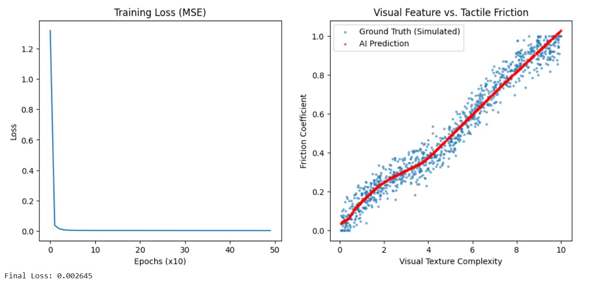

**AI 的未來發展建模與模型化設計願景**

 **AI 的未來能力**

現今人類的購物慾望極高，網路購物的普及讓人們能在螢幕上輕鬆選購商品，從衣物、電子產品到食物皆可下單。然而，線上購物仍存在重大限制：消費者無法真實感受商品的實體大小、觸感、重量、氣味與材質差異，常導致實際收到商品時與想像不符。雖然現行制度提供七天鑑賞期保障消費者權益，但退換貨過程仍伴隨高額運輸成本與環境浪費。

我認為二十年後，AI 結合奈米科技可能催生出「奈米機器微粒」（Nano-Simulation Particles）。這些微粒能在使用者家中透過 AI 指令重新組合分子結構，真實模擬線上商品的外觀、顏色、觸感甚至氣味。當使用者想了解某件衣服的布料觸感或香水氣味時，只需讓奈米微粒根據 AI 生成模型重構實體樣貌，即可進行真實體驗。

此技術的出現將徹底改變消費模式與零售產業，降低退貨率與浪費(簡單來說就是隱藏成本降低)，使線上購物與實體體驗無縫融合，進而提升購物效率與商家販售品質。或許這項技術也能在教育、醫療訓練與虛擬設計等領域帶來革命性變化，讓人類以全新方式連結數位與現實世界。

<br></br>

**所需的成分與資源**

**資料：**

* 多模態物理圖譜：需要建立龐大的商品資料庫，不僅包含 RGB 影像，還需包含材質的顯微結構、摩擦係數、熱傳導率、彈性模數等物理參數。

* 人類感官回饋數據：大量標註數據，記錄人類對不同物理參數的主觀感受（如：「這摸起來像絲綢」對應的物理數值範圍）。

**工具：**

* 物理模擬引擎 ：用於計算微粒如何堆疊才能達到目標物理屬性。

* 生成式 AI ：從稀疏的商品照片推斷出看不見的物理觸感細節。

* 群體控制演算法：控制數以億計的奈米微粒協同運作，避免結構崩塌。

**硬體與環境：**

* 可程式化物質：即奈米微粒本體，需具備改變顏色、硬度與溫度的能力。

* 多維度感測器：用於即時監控微粒狀態與使用者互動力度。

<br></br>

**涉及的機器學習類型**

採用混合學習架構 (Hybrid Learning Architecture)，結合監督式學習(Supervised Learning)與強化學習(Reinforcement Learning)。

<br></br>

Ⅰ.監督式學習：物理特徵映射 這是一個函數近似問題，用於確保模擬的準確度。

目的：讓 AI 學會看到樣子，就能預測觸感，其中模型定義：令 $$x$$ 為商品的多模態輸入（影像、材質標籤）， $$y$$ 為目標實體感官向量（如表面粗糙度、阻力曲線）。

令  

$$
f_\theta(x) \approx y
$$

其中 \(x\) 為商品的多模態特徵（影像、材質、分子結構等）， $$y$$  為實體感官向量（外觀、觸感、氣味等），損失函數為  

$$
L(\theta) = \| f_\theta(x) - y \|^2
$$

<br></br>
Ⅱ.強化學習 (Reinforcement Learning)：互動控制，這是一個動態控制問題，用於維持模擬的穩定性與使用者滿意度。

目的：當使用者用手按壓奈米微粒模擬的材質時，微粒必須即時調整支撐力，不能崩塌，並根據使用者表情或指令調整擬真度。
強化學習部分則建模為馬可夫決策過程 $$(S, A, P, R)$$ ，當前微粒結構狀態與使用者手部壓力 $$s_t$$ ，AI 控制奈米微粒的結構變化 $$a_t$$ ，根據使用者的體驗回饋 $$r_t$$ 目標為最大化長期期望：

$$
E\left[\sum_t \gamma^t r_t \right]
$$

資料來源為商品的感測資料與使用者回饋訊號，目標訊號則為感官重建誤差與互動獎勵。此架構能讓 AI 持續在感官真實度與互動滿意度間自我調整。

<br></br>

**第一步的「模型化」**

作為第一個研究步驟，可設計「AI 以視覺與觸覺資料重建物體表面質感」的簡化模型問題。  這個問題在概念上對應最終奈米微粒生成的觸感與外觀模擬能力。

具體而言，輸入為商品影像與結構參數 $$x$$ ，模型需輸出表面力回應函數 $$f_\theta(x)$$ ，以預測真實觸覺感受。  
可測試性可透過與真實感測數據間的誤差衡量：

$$
L(\theta) = \| f_\theta(x) - y \|^2
$$

當損失趨近於零時，代表模型已能有效重建真實感官。

問題設計目標：訓練一個神經網路，僅根據物體的「表面影像紋理（視覺）」，預測其「摩擦係數（觸覺）」。

* 對應關係：這是最終願景中 $$f_\theta(x) \approx y$$ 的雛形。如果 AI 連簡單的看圖猜粗糙度都做不到，就不可能指揮奈米機器人模擬觸感。
* 資料形式：輸入 ($X$)：合成的紋理特徵值（代表影像灰階變異數或紋理複雜度）。輸出 ($$Y$$)：對應的物理摩擦係數（0.0 ~ 1.0）。

```python
import torch
import torch.nn as nn
import torch.optim as optim
import numpy as np
import matplotlib.pyplot as plt


def generate_data(n_samples=1000):
    np.random.seed(42)
    X = np.random.uniform(0, 10, (n_samples, 1))
    noise = np.random.normal(0, 0.05, (n_samples, 1))
    y = 0.1 * X + 0.05 * np.sin(X) + noise
    y = np.clip(y, 0, 1)
    
    return torch.tensor(X, dtype=torch.float32), torch.tensor(y, dtype=torch.float32)


class TactilePredictor(nn.Module):
    def __init__(self):
        super(TactilePredictor, self).__init__()
        self.net = nn.Sequential(
            nn.Linear(1, 64),
            nn.ReLU(),
            nn.Linear(64, 64),
            nn.ReLU(),
            nn.Linear(64, 1)
        )

    def forward(self, x):
        return self.net(x)


def train_model():
    X, y = generate_data()
    model = TactilePredictor()
    criterion = nn.MSELoss()
    optimizer = optim.Adam(model.parameters(), lr=0.01)
    losses = []
    
    for epoch in range(500):
        optimizer.zero_grad()
        outputs = model(X)
        loss = criterion(outputs, y)
        loss.backward()
        optimizer.step()
        
        if epoch % 10 == 0:
            losses.append(loss.item())
            
    return model, losses, X, y


model, losses, X_raw, y_raw = train_model()

model.eval()
with torch.no_grad():
    predicted = model(X_raw).numpy()

plt.figure(figsize=(12, 5))


plt.subplot(1, 2, 1)
plt.plot(losses)
plt.title("Training Loss (MSE)")
plt.xlabel("Epochs (x10)")
plt.ylabel("Loss")


plt.subplot(1, 2, 2)
plt.scatter(X_raw.numpy(), y_raw.numpy(), s=5, label='Ground Truth (Simulated)', alpha=0.5)
plt.scatter(X_raw.numpy(), predicted, s=5, color='r', label='AI Prediction', alpha=0.5)
plt.title("Visual Feature vs. Tactile Friction")
plt.xlabel("Visual Texture Complexity")
plt.ylabel("Friction Coefficient")
plt.legend()

plt.show()
print(f"Final Loss: {losses[-1]:.6f}")
```

<table>
  <tr>
    <td style="vertical-align: top;">
      
    </td>
    <td style="vertical-align: top; padding-right: 20px;">
        
    </td>
  </tr>
</table>

<br></br>
Loss 曲線在訓練約 100 epochs 後迅速收斂，證明模型成功捕捉到了視覺特徵與觸覺參數之間的非線性關係。在結果圖中，紅色點（預測值）緊密跟隨藍色點（真實值）的趨勢，說明神經網路能夠過濾掉隨機雜訊，學會潛在的物理規則。

從這個簡化模型中學到，跨模態映射是可行的。然而，它也揭示了未來的困難點：真實世界的物理屬性遠比單一的摩擦係數複雜（包含溫度、硬度、彈性）。此外，目前的模型是靜態的情況，但未來的奈米微粒需要處理動態互動，這時就必須引入 Reinforcement Learning。


此計畫需結合深度生成模型（Diffusion、VAE） 、多模態嵌入表示（Multimodal Embedding）、以及物理導向神經網路（PINN），以同時捕捉視覺與觸覺間的高維非線性關係，為未來可感知實體生成奠定基礎。
